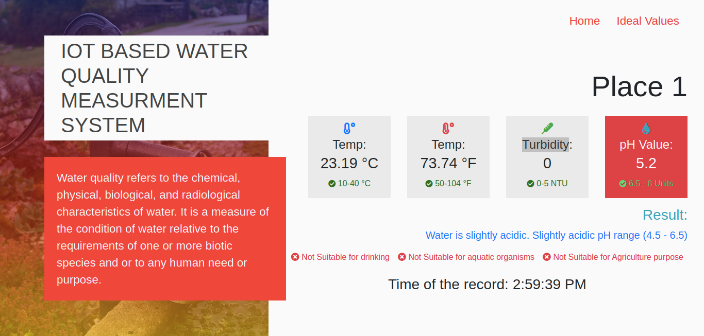

# Water-Ph-detection-with-firebase

## About
Sensors detects water quality by measuring various factors(Ph,Turbidity,temperature) and send it to Google Firebase ! This application fetch data live from firebase and measures the quality of water based on that.
I have really enjoyed developing this application. Its different and interesting at the same time ! 

